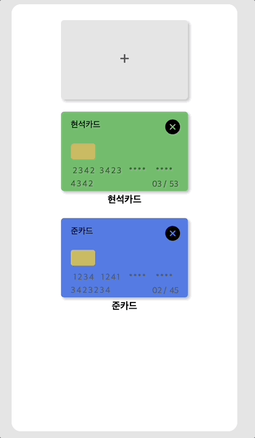

<!-- TODO: code sandbox 추가 -->

<p align="middle" >
  
</p>

**<h2 align="center">React Payments 💳</h2>**
**<h5 align="center">A Simple Payments manager</h5>**

<p align="middle" >
  
</p>

Look around every component of this Package in [📙 Storybook](https://64153ae64ded91dc4965aab5-uhqixrgsat.chromatic.com/)

<hr style="{ margin-top: 10px; margin-bottom: 10px }" />

# ⚙️ Features

**😎 Focus on User Experience**

- Automatic next Input focusing 👀
- Re-Usable, Every State is on you! 📑
- Validation Complete 🚥
- Flexible CSS, optimal in mobile 🖼️

# 🙌 Get Start!

**Install**

```shell
$ npm i @luckyjun/react-payments

$ yarn add @luckyjun/react-payments
```

**Implement Component in your Project**

```tsx
import { Payments } from '@luckyjun/react-payments';

function App() {
  return (
    <div className="App">
      <Payments />
    </div>
  )
}

export default App
```

# 📬 Type & Interface

```typescript
type CardList = { [cardId: string]: Card }

type Card = {
    cardCompany: {
        name: string;
        theme?: any;
    };
    cardNickname: string;
    cardNumbers: string[];
    expireDates: [string, string];
    cardOwner: string;
    securityCode: string;
    passwords: string[];
}

interface PaymentsProps {
  cardList: CardList;
  onCardConfirm: (card: Card, cardId: string) => any;
  onCardDelete: (card: Card, cardId: string) => any;
  onCardUpdate: (card: Card, cardId: string) => any;
  onCardSubmit: (card: Card, cardId: string) => any;
className?: string;
}
```

---

## related

[**Next Step, TDD 클린코드 with React**](https://github.com/next-step)

## TODO

- [] 서버 구축 해서 JS 제공할 수 있도록 해주기 -> Micro-Frontend
- [] 가상 랜덤 키보드 넣기
